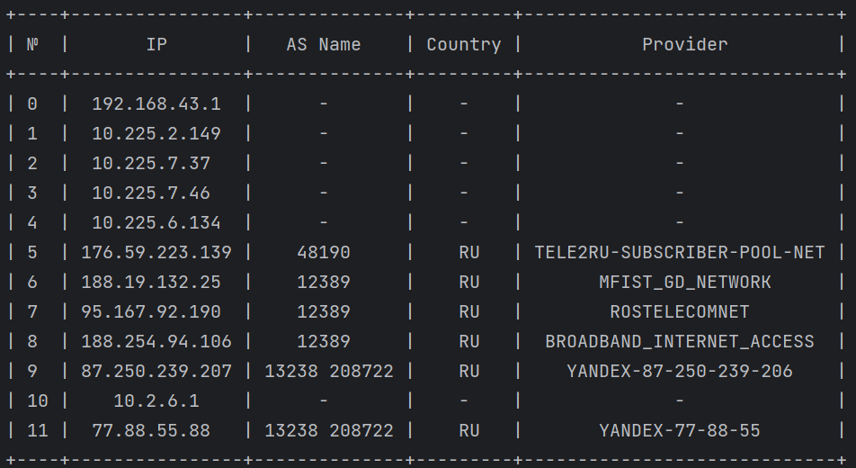
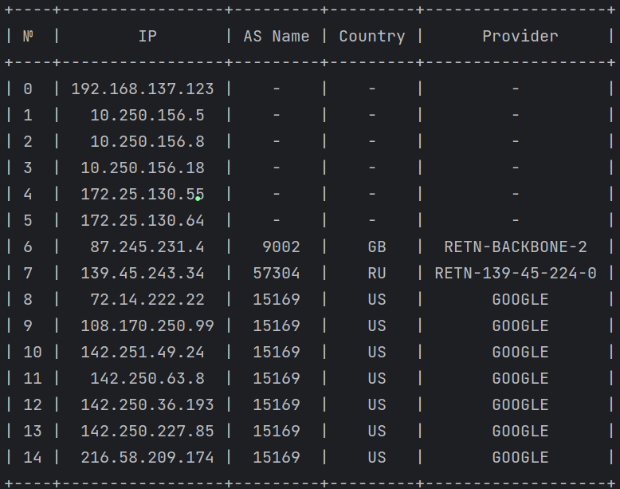

# Трассировка автономных систем
Короткова Мария КН-201

Постановка задачи:
> Пользователь вводит доменное имя
или IP адрес. Осуществляется трассировка до указанного узла (например, с использованием
tracert), т. е. мы узнаем IP адреса маршрутизаторов, через которые проходит пакет. Необходимо определить к какой автономной системе относится каждый из полученных IP адресов
маршрутизаторов. Для определения номеров автономных систем обращаться к базам данных
региональных интернет регистраторов.
Выход: для каждого IP-адреса – вывести результат трассировки (или кусок результата до появления ***), для "белых" IP-адресов из него указать номер автономной системы.

> tracert выполняет отправку данных указанному узлу сети, при этом отображая сведения о всех промежуточных маршрутизаторах, через которые прошли данные на пути к целевому узлу.

Запуск программы:
> .\main.py (ip-адрес или доменное имя)

Результаты работы программы:
>yandex.ru
> 

>google.com
>

